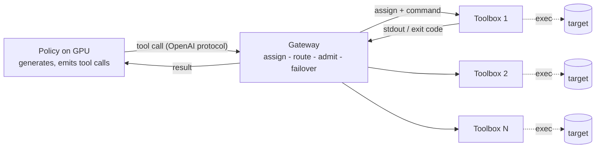

*Part 1 of a series on training a pentest agent with reinforcement learning.*

## The GPU should never wait for a shell command

When you train an agent with reinforcement learning, the unit of work is a rollout: the model proposes an action, the environment executes it, the model observes the result, and the loop repeats until the episode ends. You run thousands of these to get a single gradient step.

For a reasoning agent, "execute the action" is cheap. For a pentest agent it is not. Our actions are real commands: an nmap scan, a curl against a login form, an sqlmap run, a nuclei sweep. They take seconds, sometimes minutes, and they run on a CPU box, not the GPU.

That creates a problem. Generation happens on the GPU, which is the expensive resource we are trying to keep busy. Command execution happens off the GPU and is slow. If a rollout runs its commands inline, the GPU sits idle for the full duration of every command. In a domain where a single episode can spend most of its wall-clock time waiting on tools, a naive synchronous loop leaves the most expensive hardware you rented doing nothing for most of the run.

At RL scale, idle GPU is not a rounding error. It is the difference between a run that finishes overnight and one that finishes next week, at the same rental cost.

## The idea: decouple execution from generation

The fix is to make sure the GPU always has something to generate. While one rollout waits for its nmap scan, the GPU should be producing the next token for a different rollout. You get there by running many rollouts concurrently and pushing their command execution off the GPU entirely, onto a separate fleet of machines whose only job is to run commands.

Concretely: the policy generates on the GPU and emits tool calls. Every tool call is shipped to a pool of toolboxes that execute it and stream the output back. The GPU is free during that round trip. With enough rollouts in flight, the execution phase of one overlaps the generation phase of another, and the GPU stays saturated.

```
Synchronous (one rollout):
  GPU:   [gen]......idle......[gen]......idle......
  tools:       [ nmap ]            [ sqlmap ]

Decoupled (many rollouts, one GPU):
  GPU:   [gen A][gen B][gen C][gen A][gen D]...   (always busy)
  tools:       [A nmap ][B curl ][C sqlmap ]...   (fan out across the fleet)
```

## The architecture: a gateway serving toolboxes

Three components:

- **Policy.** The model being trained. It generates on the GPU, speaks the OpenAI protocol, and emits tool calls.
- **Toolbox.** A container carrying the full offensive toolchain (nmap, sqlmap, ffuf, nuclei, a headless browser, and the rest). It executes commands up to a small concurrency limit, streams stdout and exit codes back, and is disposable. You can run as many as you want.
- **Gateway.** The broker between the two. It assigns a rollout to a toolbox, routes each command, and manages the pool.



The agent never touches a toolbox directly. It asks the gateway to assign one for its run, then sends each command through the gateway, which forwards it to the assigned toolbox over a persistent connection and returns the result. The moment a command is dispatched, the GPU is done with that rollout until the result comes back, so it moves on to the next one.

## The same need shows up in production: one environment per workflow

Decoupling execution onto a fleet is not something we invented for reinforcement learning. It is already how the agent runs in production, for an independent reason.

A pentest run mutates its own execution environment. It writes files, unpacks wordlists, starts a background listener, drops a payload, leaves a shell open. Run two of these on the same machine and they step on each other: one run's artifacts, ports, and processes bleed into another's, and you can no longer attribute what happened to which run. So in any real deployment, each concurrent run needs its own isolated execution environment.

That is what a toolbox provides. The gateway gives each run its own capacity with its own working directory, process space, and tool state, so workflows do not interfere. Running the agent against ten targets at once is not one big job; it is ten independent workflows, each in its own environment, brokered by the same gateway. How hard you isolate is a dial: a shared pool keeps per-run working directories on packed toolboxes, and a dedicated pool gives each run a toolbox to itself.

Reinforcement learning inherits this. A training batch is just many concurrent runs, which is exactly what the production fleet already serves. We are not standing up a special training environment; we are pushing rollouts through the same isolated, brokered execution path the agent uses in production. That carries a benefit beyond throughput: there is no gap between the environment the policy trains against and the one it runs in once deployed.

## Scaling the fleet to demand

The pool size should follow the training batch, not the other way around. We size it with one number.

A rollout holds one assignment for its lifetime; call it a host-unit. A single toolbox serves up to K host-units at once (we use K = 4, bin-packed, so a toolbox fills to capacity before the next one is touched). So for a training step that runs C rollouts concurrently, you need ceil(C / K) toolboxes.

That makes provisioning a one-liner. Pick the concurrency that keeps the GPU fed, then bring up that many toolboxes:

```bash
./scale_toolboxes.sh up-for 32   # 32 concurrent rollouts -> 8 toolboxes
```

Double the batch, double the fleet. The training code only ever knows a concurrency number; the infrastructure sizes itself to it.

## Why a gateway, and not just N toolboxes

You could hand each rollout a toolbox address and skip the broker. The gateway earns its place for four reasons:

- **Admission control.** When the pool is saturated, the gateway holds the request open until a slot frees, a long poll, instead of failing it or piling work onto an overloaded box. Demand waits; it does not drop.
- **Failover.** If a toolbox dies mid-run, the gateway reassigns the rollout to a healthy one. The training loop never notices.
- **Isolation.** The same broker can route to a shared pool or to a dedicated per-tenant pool, which matters the moment more than one thing is running.
- **One place to scale.** The training code stays ignorant of how many toolboxes exist. It asks for capacity; the gateway provides it.

## Where this fits

Disaggregating an RL system so the accelerators never idle is an established pattern. HuggingFace surveyed sixteen open-source RL libraries in a post titled "Keep the Tokens Flowing" and found the field converging on one design: split inference and training onto separate pools, connect them with a buffer, and sync weights asynchronously so neither side waits. Asynchronous RLHF reports the payoff at roughly 38 percent faster than a synchronous loop with matched quality. The 2026 agentic systems such as RollArt and ROLL Flash push the same idea further, decoupling generation, environment interaction, and reward scoring so short trajectories do not stall behind long ones.

What we describe here applies that principle one level down. The usual split is generation versus training. Ours is generation versus execution: in a pentest agent the dominant off-GPU cost is not a long decode, it is a real command that runs for seconds or minutes. The gateway and the toolbox fleet are how we move that execution off the critical path, and, as the previous section argued, that same fleet is what gives each workflow its own environment in production.

## What this buys, and what comes next

With execution fanned out across the fleet, training throughput stops being bound by the slowest command and starts being bound by generation and reward, which is where you want it. The GPU generates across many rollouts while the toolboxes absorb the slow, bursty command load.

This is only the substrate. The RL loop itself, the reward design, and the trainer that turns rollouts into gradients all sit on top of it, and they are the subject of the next posts. There is also a related problem this architecture does not solve on its own. The toolbox side is isolated per run, but the target side is not: when several rollouts attack the same target instance at once, they share that target's state. Giving each rollout its own target instance is its own piece of work, and we will come back to it.

The principle generalizes past security. Any agent whose actions are slow and off-GPU, code that compiles and runs, tools that hit the network, simulators that step, has the same idle-GPU problem and the same fix: decouple execution, broker it, and scale the executors to the batch.

## References

- Hugging Face, [Keep the Tokens Flowing: Lessons from 16 Open-Source RL Libraries](https://huggingface.co/blog/async-rl-training-landscape).
- Hugging Face, [The Ultra-Scale Playbook: Training LLMs on GPU Clusters](https://huggingface.co/spaces/nanotron/ultrascale-playbook).
- Noukhovitch et al., [Asynchronous RLHF: Faster and More Efficient Off-Policy RL for Language Models](https://openreview.net/pdf?id=FhTAG591Ve), ICLR 2025.
- Hugging Face TRL, [Asynchronous GRPO](https://huggingface.co/docs/trl/async_grpo_trainer).
- [RollArt: Disaggregated Multi-Task Agentic RL Training at Scale](https://arxiv.org/abs/2512.22560); [ROLL Flash: Accelerating RLVR and Agentic Training with Asynchrony](https://arxiv.org/abs/2510.11345).
